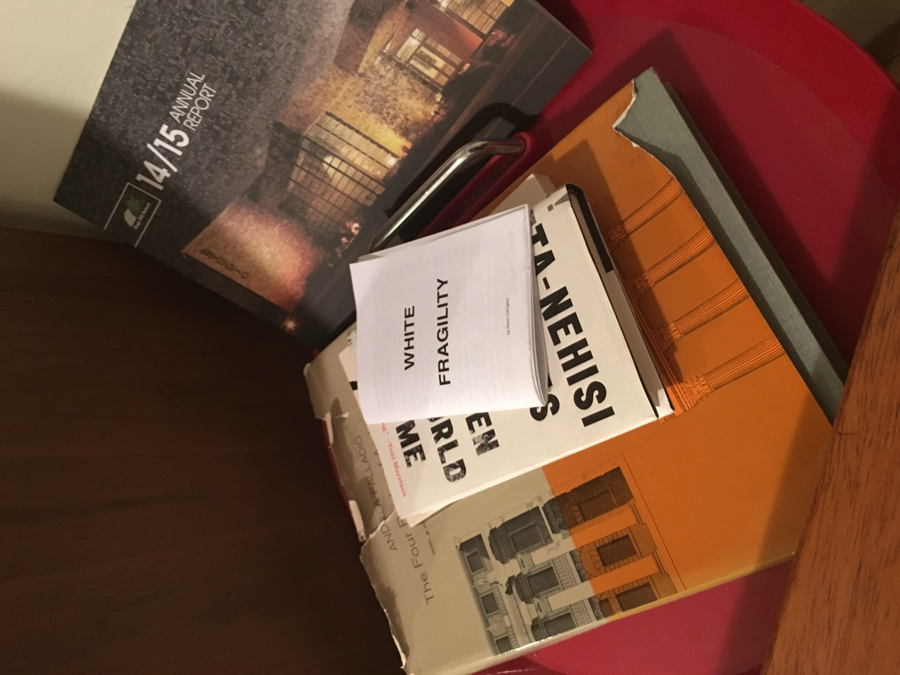

# White Fragility

## Welcome!

Printable versions of White Fragility in zine form are available here:

[Design by
Johann](https://drive.google.com/open?id=0B0A_LPl2W2T1alJnNFczMGZhem9WWVVhWDlyTEZHZk1vdmJR)

[Design by
Alex](https://drive.google.com/open?id=0B0A_LPl2W2T1Wk5yZzZBM1VobFVIQUNNbDlPblc0XzJnRlFr)

[Design by
Francis](https://drive.google.com/open?id=0B0A_LPl2W2T1YkM3QnpaZkhpdG4xb19GNXVnZU9YRU1xQ1I4)

`Because talking about race shouldn't be so stressful -_-`

Part of the Public Science Winter Residency

Folders:

`pdf` - White Fragility by Robin DiAngelo

`studies_of_subway_distribution` - Studies of printed material distributed on the subway

`booklet_test` - Test zine as a booklet straight from the PDF

`designs` - Work in progress designs for the zine

`plain_text` - Plain text verson of PDF
